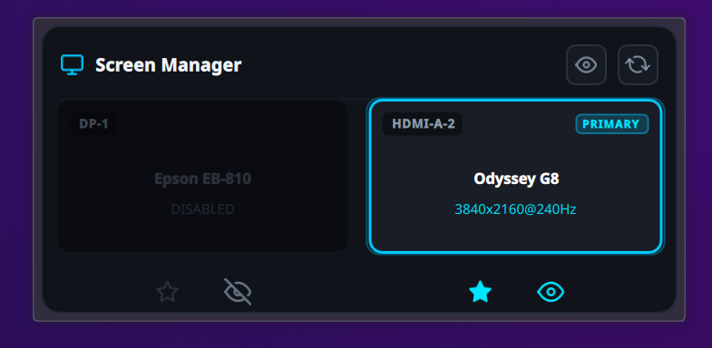
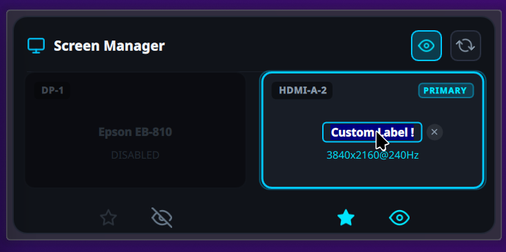
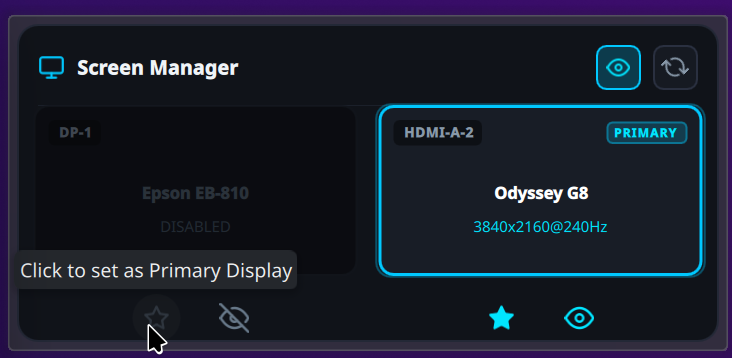

# Screen Manager for KDE Plasma 6

[](https://store.kde.org/p/2371012/)

A sleek, intuitive desktop widget for **KDE Plasma 6** on Wayland providing fast, one-click multi-monitor management, inline display renaming, and presentation mode.

Designed as a modern, productive replacement for standard display applets, it brings monitor layout control, primary display assignment, power toggling, sleep inhibition, and custom screen nicknames right to your desktop. Available now on the [KDE Store](https://store.kde.org/p/2371012/).

---

## Screenshots

<div align="center">

### Overview & Spatial Layout


<br/>

| Inline Display Renaming | Primary Display & Quick Controls |
| :---: | :---: |
|  |  |
| *Click any screen label to edit friendly names, or click **X** to reset* | *One-click primary monitor toggle, sleep inhibitor, and display power* |

</div>

---

## Requirements

- **Desktop Environment**: KDE Plasma 6.x (Wayland session)
- **Dependencies**:
  - `kscreen-doctor` (included with KDE Plasma / KScreen)
  - `systemd-inhibit` (standard on systemd-based Linux systems)
  - Python 3.8+
- **Tested On**:
  - Bazzite (Fedora Silverblue / Atomic Desktop)
  - Fedora 40 / 41 / 42 (KDE Spin)
  - Arch Linux / openSUSE Tumbleweed (KDE Plasma 6)

---

## Installation

### Method 1: Via KDE Store / "Get New Widgets" (Easiest)

You can get the widget directly through Plasma or the web:
- **From Desktop**: Right-click Desktop $\rightarrow$ **Add Widgets...** $\rightarrow$ **Get New Widgets...** $\rightarrow$ **Download New Plasma Widgets**, search for **"Screen Manager"**, and click **Install**.
- **From Web**: Visit the [KDE Store listing (ID: 2371012)](https://store.kde.org/p/2371012/) and download the `.plasmoid` file.

### Method 2: Automated Script

Clone the repository and run the installation script:

```bash
git clone https://github.com/BrunoWB/plasma-screen-manager.git
cd plasma-screen-manager
./install.sh
```

The script automatically:
1. Installs the plasmoid to `~/.local/share/plasma/plasmoids/org.scyan.screenmanager/`
2. Updates the system configuration cache (`kbuildsycoca6`)
3. Restarts the Plasma shell to load the new code immediately (with Flatpak/container detection support)

### Method 3: Manual / Pre-Built `.plasmoid`

1. Grab the latest `org.scyan.screenmanager-v*.plasmoid` package from the [KDE Store](https://store.kde.org/p/2371012/) or [Releases](../../releases) page.
2. Install via command-line:
   ```bash
   kpackagetool6 --type Plasma/Applet --install org.scyan.screenmanager-v*.plasmoid
   ```
   *Or install through the Plasma GUI:*
   - Right-click Desktop $\rightarrow$ **Add Widgets...** $\rightarrow$ **Get New Widgets** $\rightarrow$ **Install from Local File...** and select the `.plasmoid` file.

---

## Adding the Widget to Your Desktop

1. Right-click on your desktop wallpaper (or panel).
2. Select **"Add Widgets..."** (or press <kbd>Meta</kbd> + <kbd>W</kbd>).
3. Search for **"Screen Manager"**.
4. Drag and drop the widget onto your desktop or into your Plasma panel.

---

## Contributing

Pull requests, issues, and feature suggestions are warmly welcome!
If you find a bug or have a suggestion, feel free to open an issue.

---

## License

This project is licensed under the [MIT License](LICENSE).
